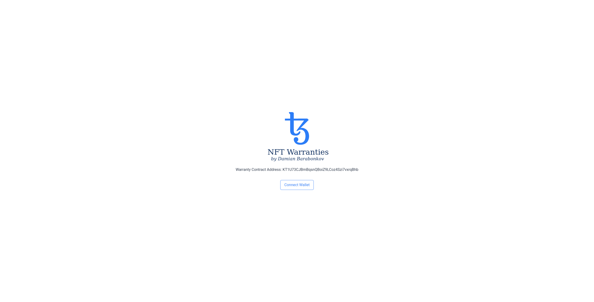
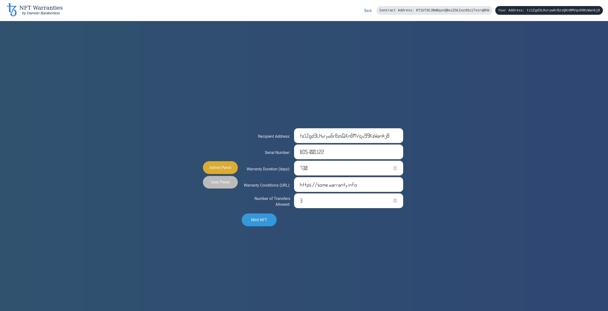
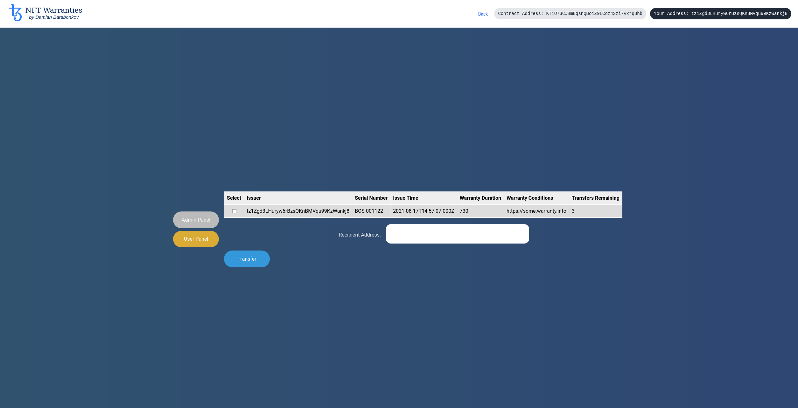

# Warranty NFTs

Smart contract deployed live on the Florence testnet at address: `KT1U73CJBmBqsnQBoiZ9LCoz4Szi7vxrqBhb`.

## Problem Statement

Many consumer products come with warranties against manufacturing and regular-use defects. Warranties are only granted when sold through an authorized dealer or store and oftentimes are valid only for a specified time.

Currently, the validity of the warranty is determined by some physical receipt or warranty card. This poses several issues:
- The warranty document is easily falsifiable.
- The warranty document is not necessarily standard among different sellers.
- A bad acting authorized dealer could issue warranty cards for expired products "under the table".

## Solution

The issues mentioned above are all byproducts of maintaining warranties in the physical world. Tokenize the warranties and many of the problems related to the "real-world" disappear. Not only are the problems resolved, but new possibilities also emerge, such as tracking the exact ownership chain.

With this solution:
- NFTs cannot be falsified.
- A warranty on this NFT DApp is standardized, no matter who issued it or when.
- Finding bad-acting dealers will be simpler since it is easier to scan the blockchain for anomalous behaviors such as multiple warranty NFTs for the same product serial number. 

New Possibilities:
- The number of warranty transfers of a product can be limited and controlled. Some warranties are non-transferable to new owners whereas others offer unlimited transfers. Tokenized warranties can accurately enforce these rules.
- A product's exact ownership chain can be traced.

### Admin Roles

The administrator address is recorded as a part of the smart contract's storage. An administrator has the right to issue to any user a new warranty NFT with its respective metadata such as the product's serial number, the warranty's duration, etc. The administrator can also transfer their privileges to another administrator address.

### User Roles

A user of this smart contract can query the blockchain for the warranty NFTs under their possession. Additionally, a user may transfer any of their warranties that are not yet expired and still have remaining allowed transfers. A user can also delegate custody of a specified warranty NFT to another address. The delegate may then operate on the NFT as if they were the user with the original ownership.

## Setup

First, install all required packages. The two principal packages are `truffle` for smart contract compilation and deployment and `taquito` for the web DApp.
```bash
# Change directory to base directory of project
cd <warranty-nft-dir>

# Install the required software
npm install -g truffle@tezos
npm install
cd web && npm install && cd ..
```

### Quick Setup

This quick setup uses an instance of this smart contract already deployed on Florence. The downside is that you will not have any admin privileges, since the admin is already set. Consequently, you will not be able to issue any warranty NFTs. You will be a simple user of the warranty DApp which can receive NFTs and transfer those in your possession to any other address.

```bash
# Run from the base directory of the project
yarn web:dev
```

Navigate to `localhost:3001` in a web browser to open the DApp.

### Total Control

Setup before deployment.
```bash
# To set a different initial admin, such as to an address under your control, 
# either modify '.../migrations/2_warranty_migration.js' under the "florence" branch
# or create a file named "faucet.json" in the base directory with your account's details
# To get a pre-made "faucet.json" file, go to https://faucet.tzalpha.net/
```

Build and deploy the smart contract.
```bash
# Note: To rebuild, if any changes were made to the smart contract code, add the flag `--reset`
# since truffle does not properly detect the changes and will not rebuild
truffle migrate --network=florence
```

Launch the web-based DApp interface. Take note of the `Warranty.mligo` contract address, which should begin with "K1...".
```bash
# Set the contract address in ".../web/data/warranty.json"
nano web/data/warranty.json

# Start up the web DApp
yarn web:dev
```

Go to `localhost:3001` in your web browser. Connect the DApp to a Tezos wallet. This project was developed using the Temple wallet, which connects just fine.

## Implementation

This project implements a tokenized warranty NFT with an accompanying web-based DApp. Specifically, it implements FA2 tokens with additional admin functionality. The smart contract code can be found in the file [Warranty.mligo](./contracts/Warranty.mligo). The `web` directory contains the DApp code.

### Smart Contract Entrypoints

The `Warranty.mligo` smart contract has 6 entrypoints, 3 of which are required by the FA2 specification.

1. Transfer - Performs a transfer of warranty NFTs.

	Input: Takes in a source address and a list of transfers to perform out of the source. A transfer consists of a destination address and the `token_id` of the token to be transferred.
    
    Output: Blockchain state updated to reflect the transfer.
	
2. Balance_of - Queries the blockchain to retrieve the ownership of a valid warranty NFT of an address.

	Input: A list of records each containing an `address` and `token_id`. The function queries whether the `address` has ownership of the input `token_id` and whether the represented warranty NFT is not passed its warranty duration.
    
    Output: A list of balances - a value of 1 signaling ownership of a valid warranty NFT and a value of 0 signaling no such ownership or an expired warranty NFT.
    
3. Update_operators - Updates any delegate operator addresses to have the authority of a given `address` and `token_id`.

	Input: A command to either add or remove an operator along with the operator details. Operator details consist of an `owner` address, the `operator` address which is receiving NFT delegation privileges and the `token_id` of the warranty NFT to be delegated.
    
    Output: Blockchain state updated to reflect the added/removed operators.
    
4. Mint - Creates a new warranty NFT for an intended recipient along with all of the associated warranty details.

	Input: A record containing the following fields:
    
    - `owner` - An address that is the recipient of the warranty NFT.
    - `serial_number` - A string containing the serial number of the product represented by the warranty NFT.
    - `warranty_duration` - A natural number representing the number of days since issuance (the time of minting) for which the warranty is still valid.
    - `link_to_warranty_conditions` - A bytes array intended to contain a URL pointing to a precise description of the warranty details.
    - `num_transfers_allowed` - A natural number representing the maximal number of transfers permitted of this warranty NFT to new owners before none more are allowed without invalidating the warranty. If the warranty is to be non-transferable, setting this figure to 0 will prevent any transfers altogether.

	Output: Blockchain state updated to reflect the newly minted warranty NFT.
    
5. Set_admin - A command initiated by the current admin to transfer administrative rights to a new admin. This sets the inputted new admin as "pending". The address of the pending new admin must confirm their role as administrator in a separate command.

	Input: The address of the new admin.
    
    Output: Blockchain state updated to reflect the pending new admin.
    
6. Confirm_admin - A command initiated by a pending new admin to confirm their role as the new administrator.

	Input: None
    
    Output: Blockchain state updated to reflect the new admin.
    
### Smart Contract State

The storage of this smart contract contains all of the state necessary for this warranty NFT project to function. The storage fields follow the FA2 token specification as well as extend it for admin support. The storage fields are as follows:

- `ledger`: A BigMap mapping `token_id` to `address` signifying ownership of a token by a particular address.
- `operators`: A set (internally implemented with a BigMap mapping values to `unit`) of tuples containing the (`owner`, (`operator`, `token_id`)).
- `reverse_ledger`: A BigMap mapping an `address` to a list of `token_id`'s owned by said address. This is a reverse lookup of the `ledger` storage field, hence the name.
- `metadata`: A BigMap mapping strings to bytes to hold any metadata related to this warranty smart contract.
- `token_metadata`: A BigMap mapping a `token_id` to a record containing the associated token's metadata. Token metadata includes issuer, owner, issue time, warranty duration, etc.
- `next_token_id`: A natural number incremented on every new warranty NFT minted. Used to retrieve the next token's identifier number.
- `admin`: A record containing the address of the current admin and any pending new admin.


### DApp Web Interface

The warranty DApp is built using React. The interface with the Tezos blockchain is performed with the `taquito` library and the "https://rpc.florence.tzstats.com" RPC server. The source code of the web DApp is found in the `web` sub-directory. 

When running, the DApp will display a homepage and prompt the user to connect their Tezos wallet.



Once connected, the DApp will recognize if the connected wallet is an administrator or not. If so, it will display two panel options, an "Admin Panel" and a "User Panel". If the connected wallet is not an administrator, only the "User Panel" option will be shown. In the case of the screenshot, the connected wallet is an admin, so both options are displayed.

Under the "Admin Panel", the administrator may enter all of the required information necessary to issue a new warranty NFT to a specified recipient.



Under the "User Panel", a user can view the warranty NFTs under their current possession as well as select any number of them to transfer to a specified recipient. Of course, in order to transfer a selected NFT, it must have transfers allowed. Otherwise, the operation will fail.



## Conclusion

This project presents an NFT application for recording product warranties on the Tezos blockchain. With such a solution, many of the issues around tracking and handling warranties in the physical world are alleviated. Additionally, new possibilities are opened such as exact tracking of a product's ownership over time and precise counting and enforcement of the number of warranty transfers permitted.

## License

This project is authored by Damian Barabonkov and is free to be used as outlined in the MIT License. Refer to the file `LICENSE` for more details.

## Disclaimer

This solution is intended for learning purposes only. It has not been professionally audited and may not cover error checking and other edge cases therefore, should not be used as a production application.